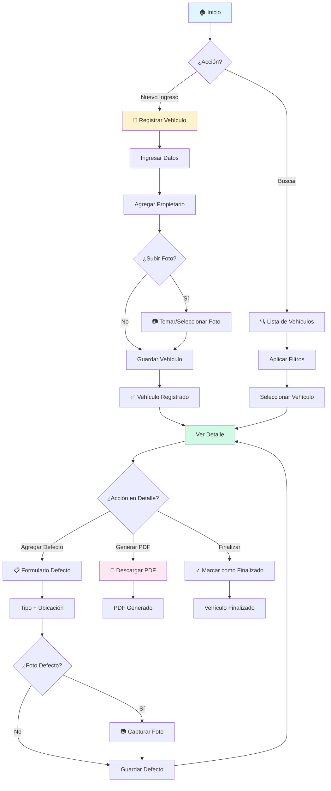
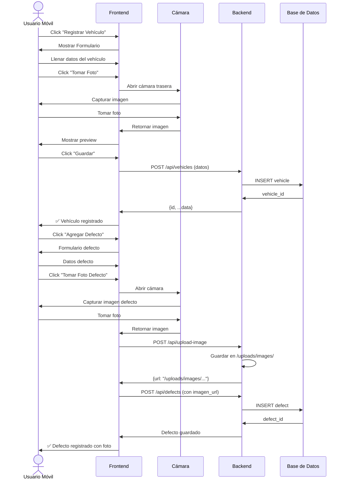
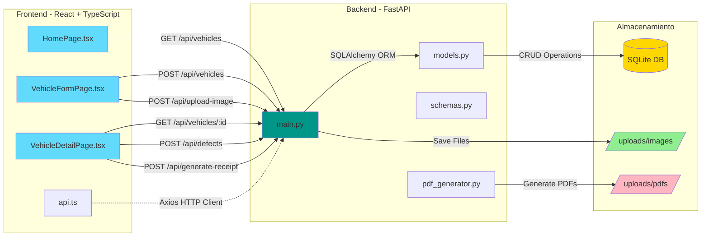
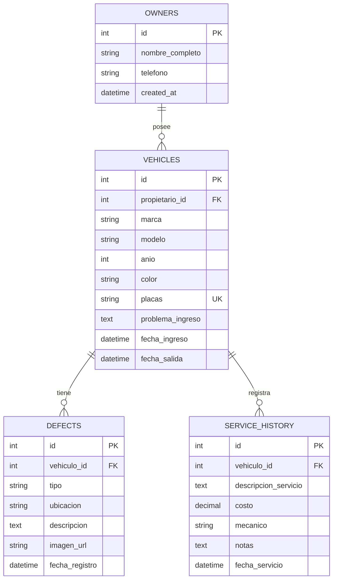

# 🚗 Taller Autos - Sistema de Gestión para Talleres Mecánicos

<div align="center">


Una aplicación web completa para gestionar talleres mecánicos, con registro de vehículos, documentación fotográfica, gestión de defectos y generación de PDFs.

[Características](#-características) • [Instalación](#-instalación-rápida) • [Uso](#-uso) • [Diagramas](#-diagramas-de-flujo) • [API](#-api-endpoints)

</div>

---

## 📋 Características

### ✅ Gestión Completa
- **Registro de Vehículos**: Captura completa de datos (marca, modelo, año, color, placas)
- **Propietarios**: Información de contacto y vehículos asociados
- **Defectos Detallados**: Registro de golpes, rayones y daños con fotos
- **Historial de Servicios**: Seguimiento de reparaciones y costos

### 📸 Documentación Visual
- **Carga de Fotos**: Desde computadora o cámara del celular
- **Foto por Defecto**: Cada daño con su imagen específica
- **Captura Directa**: En dispositivos móviles, abre la cámara automáticamente

### 🔍 Búsqueda Avanzada
- **Filtro por Marca**: Dropdown con todas las marcas registradas
- **Búsqueda de Texto**: Por modelo, placas o propietario
- **Estado**: Activos, Finalizados o Todos

### 📄 Generación de PDFs
- **Comprobantes de Ingreso**: Para firma del cliente
- **Listado de Defectos**: Con fotos incluidas
- **Información Completa**: Vehículo, propietario y servicios

---

## 🛠️ Stack Tecnológico

### Backend
| Tecnología | Versión | Uso |
|------------|---------|-----|
| **FastAPI** | 0.115.5 | Framework web REST API |
| **SQLAlchemy** | 2.0.36 | ORM para base de datos |
| **SQLite** | - | Base de datos ligera |
| **ReportLab** | 4.2.5 | Generación de PDFs |
| **Pillow** | 11.0.0 | Procesamiento de imágenes |
| **Pydantic** | 2.10.3 | Validación de datos |

### Frontend
| Tecnología | Versión | Uso |
|------------|---------|-----|
| **React** | 19.2.0 | UI Library |
| **TypeScript** | 5.9.3 | Tipado estático |
| **Vite** | 7.2.4 | Build tool |
| **React Router** | 7.1.1 | Navegación SPA |
| **Axios** | 1.7.9 | Cliente HTTP |
| **date-fns** | 4.1.0 | Manejo de fechas |

---

## 🚀 Instalación Rápida

### Pre-requisitos
- Python 3.9 o superior
- Node.js 16 o superior
- npm o yarn

### 1️⃣ Clonar el repositorio
```bash
git clone https://github.com/sergiodev3/taller-autos-app.git
cd taller-autos-app
```

### 2️⃣ Configurar Backend
```powershell
# Ir a directorio backend
cd backend

# Crear entorno virtual
python -m venv .venv

# Activar entorno virtual
.\.venv\Scripts\activate  # Windows
# source .venv/bin/activate  # Linux/Mac

# Instalar dependencias
pip install -r requirements.txt

# Copiar archivo de configuración
Copy-Item .env.example .env
```

### 3️⃣ Configurar Frontend
```powershell
# Ir a directorio frontend
cd ../frontend

# Instalar dependencias
npm install

# Copiar archivo de configuración
Copy-Item .env.example .env
```

### 4️⃣ Iniciar Aplicación

**Opción A: Scripts separados**
```powershell
# Terminal 1 - Backend
cd backend
.\.venv\Scripts\activate
uvicorn main:app --reload

# Terminal 2 - Frontend
cd frontend
npm run dev
```

**Opción B: Script único** (Windows)
```powershell
.\start-all.ps1
```

**URLs:**
- Frontend: http://localhost:5173
- Backend API: http://localhost:8000
- Swagger Docs: http://localhost:8000/docs

---

## 📱 Uso

### Flujo Básico

1. **Registrar Vehículo**
   - Ingresar datos del vehículo (marca, modelo, año, placas)
   - Agregar información del propietario
   - Opcionalmente subir foto general
   - Guardar

2. **Documentar Defectos**
   - Desde la vista de detalle del vehículo
   - Click en "Agregar Defecto"
   - Seleccionar tipo (golpe, rayón, abolladura, etc.)
   - Indicar ubicación (ej: "Puerta delantera izquierda")
   - Tomar o seleccionar foto del defecto
   - Guardar

3. **Generar PDF**
   - Click en "Generar PDF"
   - Se descarga comprobante con todos los datos
   - Listo para firma del cliente

4. **Buscar Vehículos**
   - Filtrar por marca en el dropdown
   - Buscar por modelo, placas o propietario
   - Ver estado (Activos/Finalizados)

---

## 📊 Diagramas de Flujo

### Flujo Principal de Uso



### Flujo de Registro con Foto (Móvil)



### Arquitectura del Sistema



### Base de Datos - Modelo Relacional



---

## 🔌 API Endpoints

### Propietarios
| Método | Endpoint | Descripción |
|--------|----------|-------------|
| `GET` | `/api/owners` | Listar todos los propietarios |
| `POST` | `/api/owners` | Crear nuevo propietario |
| `GET` | `/api/owners/{id}` | Obtener propietario por ID |
| `PUT` | `/api/owners/{id}` | Actualizar propietario |

### Vehículos
| Método | Endpoint | Descripción |
|--------|----------|-------------|
| `GET` | `/api/vehicles` | Listar vehículos (query: `?activos=true`) |
| `POST` | `/api/vehicles` | Registrar nuevo vehículo |
| `GET` | `/api/vehicles/{id}` | Obtener vehículo con detalles |
| `PUT` | `/api/vehicles/{id}` | Actualizar vehículo |
| `POST` | `/api/vehicles/{id}/check-out` | Marcar como finalizado |

### Defectos
| Método | Endpoint | Descripción |
|--------|----------|-------------|
| `GET` | `/api/defects/vehicle/{vehicle_id}` | Obtener defectos de un vehículo |
| `POST` | `/api/defects` | Crear nuevo defecto |
| `PUT` | `/api/defects/{id}` | Actualizar defecto |
| `DELETE` | `/api/defects/{id}` | Eliminar defecto |

### Historial de Servicios
| Método | Endpoint | Descripción |
|--------|----------|-------------|
| `GET` | `/api/service-history/vehicle/{vehicle_id}` | Historial de un vehículo |
| `POST` | `/api/service-history` | Agregar servicio |
| `PUT` | `/api/service-history/{id}` | Actualizar servicio |

### Utilidades
| Método | Endpoint | Descripción |
|--------|----------|-------------|
| `POST` | `/api/upload-image` | Subir imagen (FormData) |
| `POST` | `/api/generate-receipt/{vehicle_id}` | Generar PDF comprobante |

**Documentación interactiva:** http://localhost:8000/docs

---

## 📱 Uso desde Dispositivo Móvil

### Configuración para Red Local

1. **Obtener IP de tu computadora**
```powershell
ipconfig
# Buscar "IPv4 Address" (ej: 192.168.1.10)
```

2. **Configurar Firewall**
   - Permitir Python en Firewall de Windows
   - O permitir puerto 8000

3. **Iniciar Backend con acceso de red**
```powershell
cd backend
.\start-network.ps1
# O manualmente:
uvicorn main:app --reload --host 0.0.0.0 --port 8000
```

4. **Actualizar frontend/.env**
```env
VITE_API_URL=http://192.168.1.10:8000
```

5. **Iniciar Frontend con acceso de red**
```powershell
cd frontend
.\start-network.ps1
# O manualmente:
npm run dev -- --host
```

6. **En celular (misma red WiFi)**
   - Abrir: `http://192.168.1.10:5173`

### Captura de Fotos en Móvil

El atributo HTML `capture="environment"` permite:
- En **iOS Safari**: Opción "Tomar foto" o "Elegir existente"
- En **Android Chrome**: Abre cámara automáticamente
- Usa **cámara trasera** por defecto (ideal para objetos)

---

## 📁 Estructura del Proyecto

```
taller-autos-app/
├── backend/
│   ├── main.py                 # Aplicación FastAPI principal
│   ├── models.py               # Modelos SQLAlchemy
│   ├── schemas.py              # Esquemas Pydantic
│   ├── database.py             # Configuración de BD
│   ├── pdf_generator.py        # Generación de PDFs
│   ├── requirements.txt        # Dependencias Python
│   ├── .env                    # Variables de entorno
│   ├── .env.example            # Ejemplo de configuración
│   ├── start.ps1               # Script inicio (local)
│   ├── start-network.ps1       # Script inicio (red)
│   └── uploads/                # Archivos subidos
│       ├── images/             # Fotos de vehículos/defectos
│       └── pdfs/               # PDFs generados
│
├── frontend/
│   ├── src/
│   │   ├── pages/              # Componentes de páginas
│   │   │   ├── HomePage.tsx
│   │   │   ├── VehicleFormPage.tsx
│   │   │   └── VehicleDetailPage.tsx
│   │   ├── api.ts              # Cliente HTTP Axios
│   │   ├── App.tsx             # Componente principal
│   │   └── main.tsx            # Punto de entrada
│   ├── public/                 # Archivos estáticos
│   ├── package.json            # Dependencias Node
│   ├── vite.config.ts          # Configuración Vite
│   ├── tsconfig.json           # Configuración TypeScript
│   ├── .env                    # Variables de entorno
│   ├── start.ps1               # Script inicio (local)
│   └── start-network.ps1       # Script inicio (red)
│
├── start-all.ps1               # Inicia backend + frontend
└── README.md                   # Este archivo
```

---

## 🧪 Testing

### Backend
```powershell
cd backend
pytest
```

### Frontend
```powershell
cd frontend
npm run test
```

---

## 🐛 Troubleshooting

### Error: "Network Error" o "Connection Timeout"

**Causa**: El frontend no puede conectarse al backend

**Solución**:
1. Verificar que backend esté corriendo: `http://localhost:8000/docs`
2. Verificar `frontend/.env` tenga `VITE_API_URL=http://localhost:8000`
3. Reiniciar frontend después de cambiar `.env`

### Error: "CORS Policy Blocked"

**Causa**: Backend no permite origen del frontend

**Solución**:
- Verificar que `main.py` incluya tu IP en `allow_origins`
- Ejemplo: `["http://localhost:5173", "http://192.168.1.10:5173"]`

### Cámara no funciona en móvil

**iOS Safari**:
- Requiere HTTPS en producción
- En desarrollo local funciona con HTTP

**Android Chrome**:
- Funciona con HTTP
- Verificar permisos de cámara en navegador

### Base de datos bloqueada

**Error**: `database is locked`

**Solución**:
```powershell
cd backend
Remove-Item taller_autos.db
# Reiniciar backend (crea BD nueva)
```

---

## 🚀 Despliegue a Producción

### Backend (Railway / Render / Heroku)

1. **Configurar variables de entorno**
```env
DATABASE_URL=postgresql://...  # Si usas PostgreSQL
UPLOAD_DIR=/app/uploads
SECRET_KEY=tu-clave-secreta
```

2. **Procfile** (Heroku)
```
web: uvicorn main:app --host 0.0.0.0 --port $PORT
```

### Frontend (Vercel / Netlify / GitHub Pages)

1. **Build de producción**
```bash
npm run build
```

2. **Configurar variable de entorno**
```env
VITE_API_URL=https://tu-api.railway.app
```

3. **Deploy**
```bash
# Vercel
vercel --prod

# Netlify
netlify deploy --prod
```

---

## 📄 Licencia

Este proyecto está bajo la Licencia MIT. Ver archivo `LICENSE` para más detalles.

---

## 👥 Contribuciones

Las contribuciones son bienvenidas. Por favor:

1. Fork el proyecto
2. Crea una rama para tu feature (`git checkout -b feature/AmazingFeature`)
3. Commit tus cambios (`git commit -m 'Add: nueva característica'`)
4. Push a la rama (`git push origin feature/AmazingFeature`)
5. Abre un Pull Request

---

## 📞 Soporte

Para reportar bugs o solicitar features:
- Abre un [Issue](https://github.com/sergiodev3/taller-autos-app/issues)
- Contacto: [sergio@example.com](mailto:sergio@example.com)

---

## 🙏 Agradecimientos

- [FastAPI](https://fastapi.tiangolo.com/) por el excelente framework
- [React](https://react.dev/) por la biblioteca de UI
- [Vite](https://vitejs.dev/) por la increíble velocidad de desarrollo
- Comunidad de desarrolladores por su apoyo

---

<div align="center">

**Desarrollado con ☕ por [Sergiodev3](https://github.com/sergiodev3)**

⭐ Si te gusta este proyecto, dale una estrella en GitHub!

</div>
